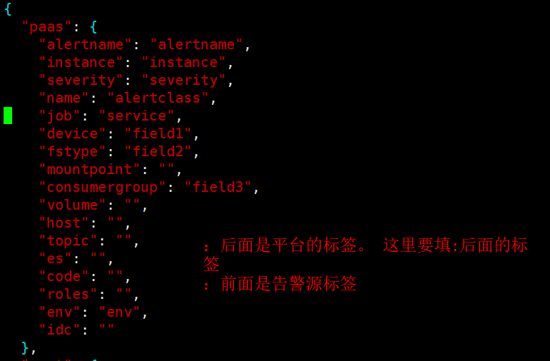

### 产品信息
```
水滴聚合短信PaaS：
测试申请流程: 发联调申请邮件(@xyhu12) -> 创建产品线 -> 申请平台(聚合短信) 和 产品线 权限 ->  创建模板并审核 -> 调试
生产申请流程: 发上线申请邮件(@xyhu12) -> 创建产品线 -> 申请平台(聚合短信) 和 产品线 权限 ->  创建模板并审核 -> 上线
产品名称：质效平台-监控
产品标识：BILPIEWU (生产测试一致)
产品密钥：be2578a2cfc6fd481e39e7d4603bb45f (生产测试一致)
管理后台测试:  http://predrip.xfpaas.com/drip/
管理后台生产:  http://shdripsso.xfpaas.com/drip/
签名:  讯飞-质效平台监控

    测试环境模板: https://pretest.xfpaas.com/dripsms/sms
    12263 恢复 [恢复] [告警项]: <title> [实列名]: <instance> [开始时间]: <start_time> [结束时间]: <end_time>
    12262 告警 [告警] [告警项]: <title> [实列名]: <instance> [开始时间]: <start_time> [当前值]: <value>

    生产环境模板: https://dripsms.xfpaas.com/sms
    12485 - 恢复 [告警项]: <alertname> [实列名]: <instance> [开始时间]: <start_time> [结束时间]: <end_time>
    12484 - 告警 [告警项]: <alertname> [实列名]: <instance> [开始时间]: <start_time> [当前值]: <value>

```

### 配置信息

```shell
# AlertReceive - SMS
PAAS_SMS_ENDPOINT="https://pretest.xfpaas.com/dripsms/sms"
PAAS_SMS_APPID="BILPIEWUA"
# 这个不用改
PAAS_SMS_SUCCESS_CODE="000000"
# 发送告警的模板id
PAAS_SMS_TPID_ALARM=122621
# 恢复告警的模板id 如果恢复和告警模板一致 那就填一样的
PAAS_SMS_TPID_RESOLVE=122632
# 注意这里需要填config.json 后面二次告警平台的标签，且你在短信平台填的模板也要按照这个key去填 如下图
PAAS_SMS_TEMPLATE_ALARM_FIELDS=["alertname", "instance", "start_time", "value"]
PAAS_SMS_TEMPLATE_RESOLVE_FIELDS=["alertname", "instance", "start_time", "end_time"]
```


